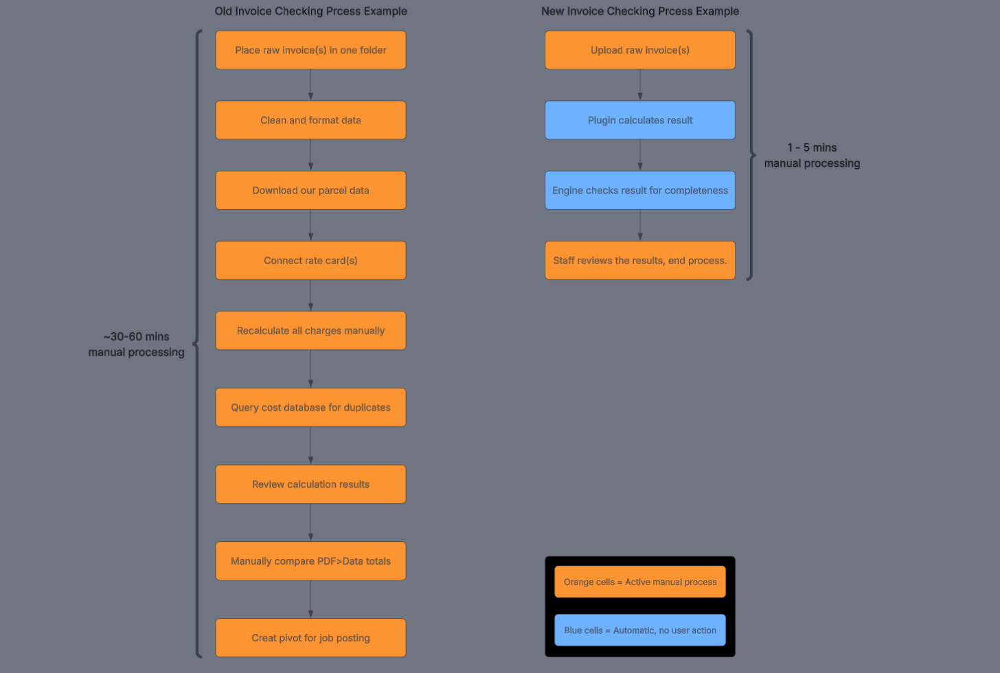

# Invoice Checking Application

A standardised, locally hosted web app for checking freight invoices. One engine runs a plug-in module per supplier. Every invoice is re-priced against the rate card(s) and our own parcel data. Built to replace existing manual workflows for ~50 suppliers, handling ~250 invoices a week.

This repo is the design record: architecture, decisions and evidence. It contains no source code.

**Application architecture:**

One standardised engine, supplier specific plugins, three external data sources

**Old vs new process comparison:**

