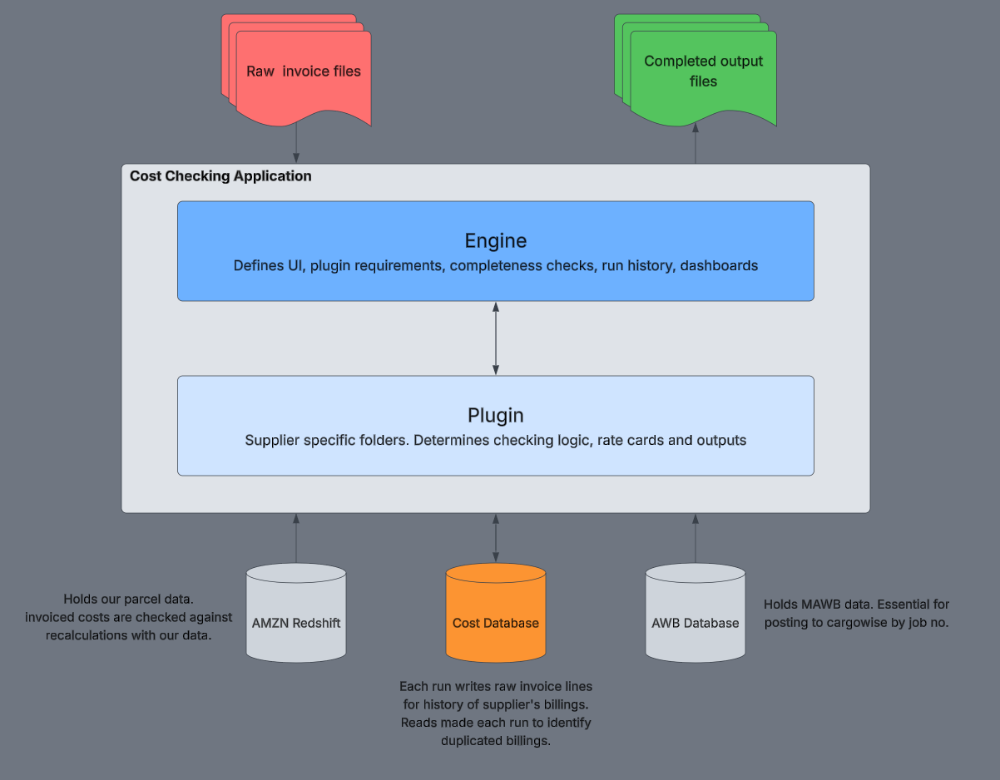
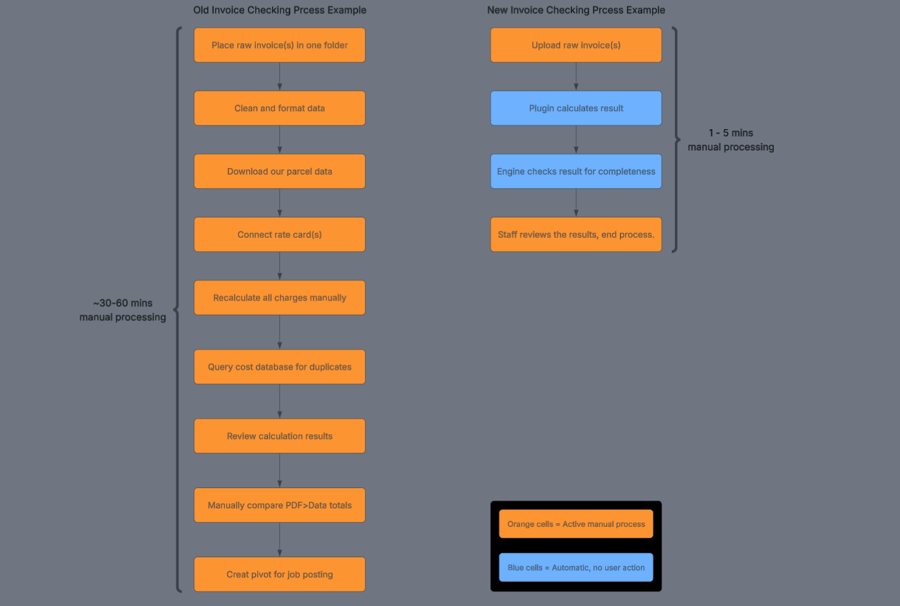
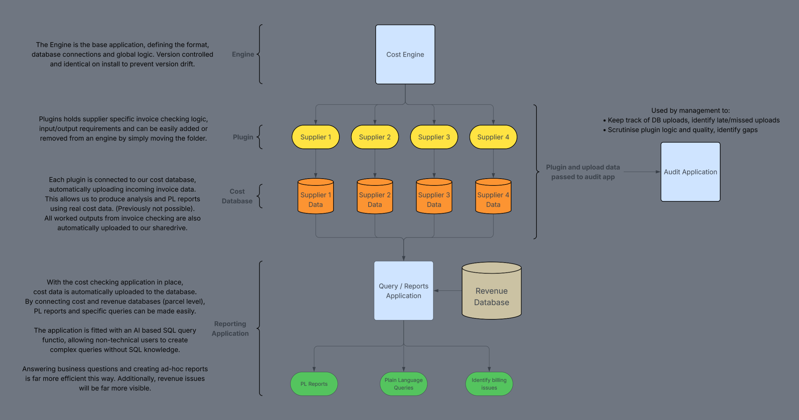

# Invoice Checking Application

A standardised, locally hosted web app for checking freight invoices. One engine runs a plug-in module per supplier. Every invoice is re-priced against the rate card(s) and our own parcel data. Built to replace existing manual workflows for ~50 suppliers, handling ~250 invoices a week.

This repo is the design record: architecture, decisions and evidence. It contains no source code.

**Application architecture:**

One standardised engine, supplier specific plugins, three external data sources

**Old vs new process comparison:**

Time saved per invoice checking is up to ~1hr of manual processing each run. A single user may execute ~5-10 runs per week.

**Application Ecosystem**

By ingesting and storing all invoice data and supplier plugin logic appropriately, we can build more tools on top of the invoice checking app. Most notably; a reporting and plain language query tool for searching our data and an audit engine, tracking the progress of DB uploads and check completions, also used to scrutinise checking logic and improve plugins.

